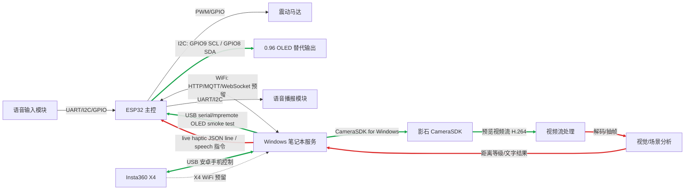

# OmniEye Kanban

Last updated: 2026-05-23

## Current Task Center

当前主线是把已经拿到的 X4 预览视频流接到距离感知链路：

```text
X4 USB preview stream -> Windows agent -> H.264 decode/frame extraction -> depth-service -> live haptic JSON -> ESP32/OLED -> motor later
```

当前正在做的工程任务：

- `windows-agent`: 将 `preview_stream_0.h264` 或实时 SDK 回调数据解码成低频图像帧。
- `depth-service`: 接收抽帧图像，接入 DAP 或先用替代深度输入跑通危险等级输出。
- `ESP32`: 继续用 OLED 代替马达显示等级；物理串口和 OLED 冒烟测试已通过，实时 JSON line 联调正在做。

刚完成的子任务：

- `depth-service` 已新增 `extract-frames` CLI，可从 X4 H.264 预览流按低 FPS 抽出 JPEG 帧；已用 `preview_stream_0.h264` 实测抽出 3 张 JPEG，源帧率约 `29.97fps`。

## Architecture Status

颜色约定：

- 绿色链路：已经在现场实测通过。
- 红色链路：当前任务中心，正在接入或联调。
- 默认颜色：未做、预留或尚未验证。

说明：`ESP32 -> 震动马达` 仍保持默认色，因为当前硬件验证阶段用 OLED 替代马达；不能把 OLED 验证等同于马达驱动验证。



## Done

- GitHub repo `https://github.com/prophetricker/OmniEye` initialized on `main`.
- ESP32 detected on `COM7`.
- OLED wiring verified:
  - `OLED GND -> ESP32 GND`
  - `OLED VCC -> ESP32 3V3`
  - `OLED SCL -> ESP32 GPIO9`
  - `OLED SDA -> ESP32 GPIO8`
- OLED display path verified with `Level: 3 / Dist: 0.72m`.
- Windows to ESP32 physical serial smoke test verified through `mpremote`; live JSON line integration is still in P0.
- X4 USB SDK mode fixed:
  - X4 USB mode: `安卓手机控制`
  - SDK USB device: `VID_2E1A PID_0002`
  - Windows driver: `libusbK`
- Official `CameraSDKTest.exe` can open X4 and start/stop preview live stream.
- OmniEye `windows-agent` builds on this machine with Visual Studio Build Tools 2026.
- OmniEye `windows-agent` can open X4 and write `windows-agent/frames/preview_stream_0.h264`.
- `depth-service` unit tests pass.
- `esp32-firmware` simulator tests pass.

## Todo

### P0: End-to-End Distance Haptic MVP

- Decode `preview_stream_0.h264` into sampled frames. Done for offline file mode; real-time callback extraction remains pending.
- Add a repeatable frame extraction smoke test. Done for unit test and current X4 sample file; next is scripted real-time smoke.
- Feed sampled frames into `depth-service`.
- If DAP is too heavy for immediate demo, add a temporary mock/depth-map mode that preserves the same output protocol.
- Send live `haptic` JSON lines from Windows to ESP32 over USB serial.
- Show live level/distance on OLED.
- Replace OLED output with vibration motor driver after software path is stable.

### P1: DAP Integration

- Locate or vendor-reference the official Depth Any Panoramas project outside Git-tracked model weights.
- Document model install and weight placement under `models/` or `dap_weights/`.
- Add a single-image inference command.
- Convert DAP output to ROI distance using the existing lower-center ROI logic.
- Calibrate default thresholds at about `3.0m`, `1.5m`, `0.8m`, and `0.4m`.

### P2: Scene Description and Speech

- Reserve a Windows-side vision API adapter for scene descriptions.
- Define `speech` JSON line payloads.
- Choose the first speech path:
  - ESP32 to external TTS module over UART/I2C, or
  - Windows-side speech output for hackathon demo.
- Keep voice input disabled until distance haptic feedback is stable.

### P3: Reliability and Demo Ops

- Add one-command bringup scripts for X4 diagnosis, agent startup, depth service, and ESP32 serial output.
- Improve failure messages for wrong X4 USB mode, missing `libusbK`, busy camera, missing COM port, and no OLED response.
- Add a demo checklist: camera mode, ESP32 COM port, OLED display, frame output, depth output, serial output.

## Current Field Notes

- Do not open Insta360 Studio or `CameraSDKTest.exe` while `omnieye_windows_agent.exe` is using the camera.
- X4 firmware observed during SDK open: `v1.9.21`.
- Current X4 path is USB; WiFi is reserved for later if needed.
- Current ESP32 output path is OLED; motor driver wiring is intentionally postponed.
